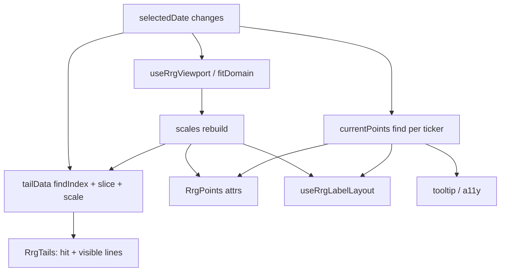

# C16 Research: Render / Playback Optimization

**Status:** Research only (no implementation yet)  
**Date:** 2026-07-25  
**Depends on:** C13 long-playback fixtures; C15 tail hit-targets (shipped)  
**Audience:** Maintainers / reviewers — decide approach before coding  
**Parent plan:** [C16-optimization.md](./C16-optimization.md)

---

## Executive summary

With a **capped `tailLength`** (demo default ~8–10), long histories (100–500 points/ticker) do **not** explode SVG node count. After C15, a typical long-playback frame is still ~**144** tail-related lines (8 tickers × 9 segments × 2 for hit+visible).

The expensive pattern under scrub/play is therefore less “D3 math” and more:

1. **Full reactive cascade** on every `selectedDate` change (viewport → scales → tails → points → labels → a11y)
2. **Vue remount churn** on tail `<line>`s whose keys include `segment.date` (sliding window remaps dates every frame)
3. A **different regime** if callers set `tailLength ≈ history length` (thousands of hit+visible lines)

**Recommended direction:** measure first, then ship **exact-by-default cheaper patching** (stable keys + **scrub→chart coalesce required by the original Playback Controls Sub-PRD**). Defer path merging / decimation / hit LOD unless full-history tails prove necessary for real consumers.

---

## Context and constraints

| Constraint | Implication |
|------------|-------------|
| Renderer-only package | No RRG calc, fetch, or caching |
| Vue owns DOM; D3 is math only | Stay on SVG; no Canvas/WebGL in C16 |
| C15 hit strokes shipped | Every visible segment has a twin hit `<line>` (`stroke-width` 12) |
| Defaults must stay visually identical for short demos | Approximation only if opted in or clearly gated |
| Unit tests required for any helpers | Playwright FPS may complement, not replace Vitest |

Out of scope (confirmed): Canvas/WebGL, Fit-All rewrites unless proven hot, Sector Orbit integration (C10), silent quality loss at default settings.

---

## Current architecture (hot paths)



### Key files

| Area | File | Cost on date change |
|------|------|---------------------|
| Tail math | `src/composables/useRrgTailSlices.ts` | O(T×P) finds + O(T×S) segment build |
| Viewport | `src/composables/useRrgViewport.ts` + `viewportDomain.ts` | `fit`: another window walk; `max`: full extent; `center`: cheap |
| Labels | `src/composables/useRrgLabelLayout.ts` | Spatial-bin × ticker count (fine at T≤50 for layout alone) |
| Playback | `useRrgPlaybackControls.ts` / `playback.ts` | Scrub emits date on every `input` (**no coalesce yet**); play uses rAF; no catch-up after tab throttle (aligned with CX §8–9) |
| Tails DOM | `src/components/RrgTails.vue` | 2×`<line>` per segment; **keys include date** |
| Chart | `src/components/RrgChart.vue` | Wires all of the above |

### Critical detail: date-keyed segments

```vue
<!-- RrgTails.vue — both hit and visible lines -->
:key="`${tail.ticker}-hit-${i}-${segment.date}`"
:key="`${tail.ticker}-${i}-${segment.date}`"
```

For a fixed `tailLength`, scrubbing slides the window: index `i` keeps a slot, but `segment.date` changes every frame. Vue’s keyed diff then tends to **tear down and recreate** line nodes instead of patching `x1/y1/x2/y2` / opacity. That is the leading hypothesis for capped-tail scrub cost after C15.

---

## Cost model

**Symbols**

| Symbol | Meaning |
|--------|---------|
| T | Visible tickers |
| P | Points per ticker (history length) |
| L | Window = min(tailLength, frameIndex+1) |
| S | Segments per ticker = max(0, L−1) |

**Tail SVG lines (post-C15)** = `2 × T × S` (hit + visible).

### Node estimates (latest frame)

| Scenario | T | P | tailLength | S | Tail lines (hit+vis) |
|----------|---|---|------------|---|----------------------|
| Sector default | 6 | 16 | 10 | 9 | **108** |
| longPlayback100 | 8 | 100 | 10 | 9 | **144** |
| longPlayback200 | 8 | 200 | 10 | 9 | **144** |
| longPlayback500 | 8 | 500 | 10 | 9 | **144** |
| LP100 full history | 8 | 100 | 100 | 99 | **1,584** |
| LP200 full history | 8 | 200 | 200 | 199 | **3,184** |
| LP500 full history | 8 | 500 | 500 | 499 | **7,984** |

**Implication:** C15’s “~4k hit lines at 500” applies to **full-history** windows, not the demo’s capped `tailLength: 10` mounts. Two product modes must be measured separately.

---

## Existing measurements (repo today)

| Source | What it shows | Gap |
|--------|---------------|-----|
| `tests/tail.performance.test.ts` | 50×30 pure `tailData` avg **&lt; 16ms** | No DOM patch / FPS |
| `tests/demo.longPlayback.test.ts` | Mounts LP50–500 with `tailLength: 10`; soft compute budgets 16/40/120ms | Recreates composable each iter; segments stay ~72 |
| C11 / C5 plan notes | Historical smoke budgets; FPS not automated | Still true |
| Browser FPS under scrub/play | **None recorded** | Required for C16 spike |

---

## Feedback crosswalk: Playback Controls Sub-PRD (Unit CX → C12)

Reviewers shared the original **Unit CX: Playback Controls** Sub-PRD. That document is the parent of **[C12](./C12-playback-controls.md)** (already implemented as `RrgPlaybackControls`). It is **not** a replacement for C16, but it **locks a scrub performance requirement** that C16 should finish.

### What CX already delivered via C12

| CX requirement | Status in repo |
|----------------|----------------|
| Separate controlled `RrgPlaybackControls` (props + `update:*` emits) | Done |
| Play/pause toggle, step, scrubber, speed, date + frame labels, loop affordance | Done |
| Keyboard: Space / arrows / Home / End | Done |
| rAF playback loop; no catch-up when tab backgrounded | Done (`useRrgPlayback`) |
| Snap / clamp edge cases | Done |
| Ambiguity rule (playing? where? how fast?) | Done (demo + a11y labels) |

### What CX requires that C16 must close

| CX citation | Requirement | Current gap |
|-------------|-------------|-------------|
| §7.3 Scrubbing | Live scrubber preview; **must not jitter the chart** (ties to viewport stability) | Scrubber is live; chart receives **every** `input` → `update:selectedDate` with no coalesce (`onScrubInput` in `useRrgPlaybackControls.ts`) |
| §9 Rapid scrub-drag | **Scrubber handle not debounced** (visually smooth); **chart re-render coalesced** — avoid full chart updates at input event rate (~60/s) | Handle is fine (native range); **chart path not coalesced** — this is the C16 scrub work item |
| §7.3 + C8 | No jitter during replay | Still depends on Fit-All stability + update rate; coalesce reduces pressure |

**Locked for C16 (from CX, not optional):**

> During rapid scrub-drag: scrubber UI tracks the pointer continuously; chart `selectedDate` updates are **rAF-coalesced** (at most one chart frame per animation frame, landing on the latest scrub index). Play-loop emits stay one date per playback tick (unchanged).

This upgrades the research “optional scrub coalesce” item to a **required first-wave deliverable**, alongside stable tail keys.

### Implementation progress

| Item | Status |
|------|--------|
| Stable segment Vue keys (`ticker` + index; no date in key) | **Done** — `RrgTails.vue`; regression in `RrgChart.tails.test.ts` |
| CX scrub coalesce | **Done** — `scrubCoalesce.ts` + `useScrubDatePreview.ts`; live preview + ≤1 emit/rAF |
| Opt-in simplify / hit LOD | **Deferred** — product default is capped `tailLength`; full-history toggle (off by default) may come later for testing |

### Product decision (owner)

- **Typical mode:** capped `tailLength` (~8–15).  
- **Full history:** desirable if rendering stays cheap; add a **demo/testing toggle off by default** in a follow-up — not part of C16 first wave.

### What CX does *not* ask C16 to do

- Rebuild playback UI or change the controlled-component contract  
- Multi-chart sync, session persistence, variable frame durations  
- Replace Playwright smoke for C12 (already covered separately)

---

## Candidate optimizations

Ratings: **Impact** / **Effort** / **Fidelity or API risk**.

### A. Patch hygiene (preferred first wave)

| Idea | Impact | Effort | Risk | Notes |
|------|--------|--------|------|-------|
| Stable segment keys (`ticker` + index; drop date from key) | **H** (capped scrub) | **L** | Low | Directly attacks remount hypothesis; preserves fade + C15 hits |
| rAF-coalesce chart `selectedDate` while scrubbing (CX §9) | **H** under drag | L–M | Low if handle stays live | **Required** — not optional; play path unchanged |
| Date→index map / binary search | M at P=500 | L | Low | Likely secondary to DOM cost |

### B. Approximation / DOM reduction (second wave if needed)

| Idea | Impact | Effort | Risk | Notes |
|------|--------|--------|------|-------|
| Decimate older samples | H if S large | M | Med fidelity | Needs documented trigger |
| Single `<path>` + gradient vs N `<line>`s | H if S large | H | High | Conflicts with per-seg opacity + C15 hits unless hits redesigned |
| Hit LOD (last K segments / wider fewer hits) | M when S large | M | Med pointer UX | Natural C15 follow-up |
| Adaptive silent `tailLength` | M | M | **High** UX surprise | Prefer explicit prop |

### C. Lower priority / low leverage for current demo

| Idea | Why deprioritize |
|------|------------------|
| Virtualize scrubber tick marks | Range input is already O(1) DOM |
| Prefetch next-frame slices | Extra memory; unclear win vs patch hygiene |
| Dirty only changed series | Hover/highlight still needs siblings |
| Freeze Fit-All domain while playing | Behavior change; only if domain churn proves hot |

---

## Recommended approach

### Spike order (before or as C16a)

1. **Browser measure** on `longPlayback200` / `500`:
   - `tailLength = 10` vs `tailLength = P`
   - Scrub-drag FPS + play FPS
   - Chrome Performance: scripting vs rendering vs painting
   - Count `.rrg-tail-hit` / `.rrg-tail-segment` nodes
2. **A/B stable keys** — temporary patch; compare recreate vs attribute update.
3. **A/B scrub rAF coalesce** — live scrubber value, chart updates ≤1/frame.
4. Only if full-history mode is a real product need: path/decimate/hit LOD spike.

### Preferred implementation direction (C16)

**Exact by default; cheaper updates; honor CX scrub contract.**

1. Stable Vue keys for hit + visible segments  
2. **Required:** rAF-coalesce chart date updates during scrub-drag (scrubber handle stays live; CX §7.3 / §9)  
3. Opt-in API only if needed, e.g. `maxTailSegments` / `tailSimplify` — **not** silent adaptive length  
4. Cheap date-index helper if profiles show finds in the top samples  

**Acceptance bar (proposed):**

- Defaults visually identical for `default` / ≤30 pts  
- Scrub-drag: handle smooth; chart updates ≤1 per rAF to latest index (unit-testable)  
- Before/after numbers on `longPlayback200` or `500` (Vitest mount+N date steps + at least one manual/browser note)  
- No Canvas; tests green  

### Alternatives

| Alt | When to choose |
|-----|----------------|
| **Minimal** — measure + stable keys + scrub coalesce only | Sector Orbit never uses long `tailLength`; enough after CX scrub fix |
| **Aggressive** — path merge + hit LOD | Callers routinely show near-full history tails and still lag after hygiene |

### Split C16a / C16b?

**Yes if** spike shows both “patch hygiene + scrub coalesce” and “approximation” are required.  
**No if** keys + scrub coalesce meet budgets — keep one unit.

---

## Decisions requested from scrutiny

Please comment / decide:

1. **Product mode:** Do real callers (Sector Orbit) ever set `tailLength ≈ P` for long histories, or is capped ~8–15 the real mode?
2. **Pain point priority:** After CX scrub coalesce, is remaining pain continuous play, dense ticker counts (T≫8), or full-history tails?
3. **Fidelity contract:** Exact segments always at defaults — OK to document opt-in LOD above N segments?
4. **Hit targets:** May hit strokes thin out before visible strokes when S is large?
5. **Viewport:** Acceptable to freeze Fit-All domain during play/scrub (behavior change)? *(CX/C8 prefer no jitter; freeze is one option — not required if coalesce + stable keys suffice.)*
6. **Measurement bar:** Vitest mount + N scrubs + manual demo enough, or require Playwright FPS?
7. **API:** Internal-only vs public `maxTailSegments` / `tailSimplify` in v0.x?
8. **Scope split:** Approve first wave = **stable keys + CX scrub coalesce** (approx deferred), or mandate approximation in the same unit?

**Already locked from CX Sub-PRD (no decision needed):** scrubber handle live; chart date updates coalesced under rapid scrub.

---

## Proposed C16 acceptance checklist (draft)

- [ ] Spike notes + locked decisions recorded in [C16-optimization.md](./C16-optimization.md)  
- [ ] Stable segment keys land (exact visuals at default settings)  
- [ ] CX §9 scrub coalesce: handle live; chart ≤1 update/rAF to latest index (tests)  
- [ ] At least one optimization lands with before/after numbers on LP200 or LP500  
- [ ] Defaults remain visually identical for short demos  
- [ ] Unit tests cover new helpers; existing chart + playback tests stay green  
- [ ] Overview / AGENTS updated if new modules appear  

---

## References

- Plan stub: [C16-optimization.md](./C16-optimization.md)  
- Playback Sub-PRD lineage: [C12-playback-controls.md](./C12-playback-controls.md) (Unit CX)  
- Tail hover / hit cost: [C15-tail-hover.md](./C15-tail-hover.md)  
- Long fixtures: [C13-demo-playground.md](./C13-demo-playground.md)  
- Tests: `tests/tail.performance.test.ts`, `tests/demo.longPlayback.test.ts`, `tests/RrgChart.tailHover.test.ts`, `tests/RrgPlaybackControls.test.ts`  
- Implementation hotspots: `useRrgTailSlices.ts`, `RrgTails.vue`, `RrgChart.vue`, `useRrgPlaybackControls.ts`

---

## Document history

| Date | Note |
|------|------|
| 2026-07-25 | Initial research for scrutiny (post-C15 push); no code changes |
| 2026-07-25 | Incorporated Unit CX Playback Controls Sub-PRD feedback: scrub coalesce promoted to required C16 deliverable; C12 crosswalk added |
| 2026-07-25 | Implemented stable keys + scrub coalesce; product mode locked to capped tails; full-history toggle deferred (off by default when added) |
