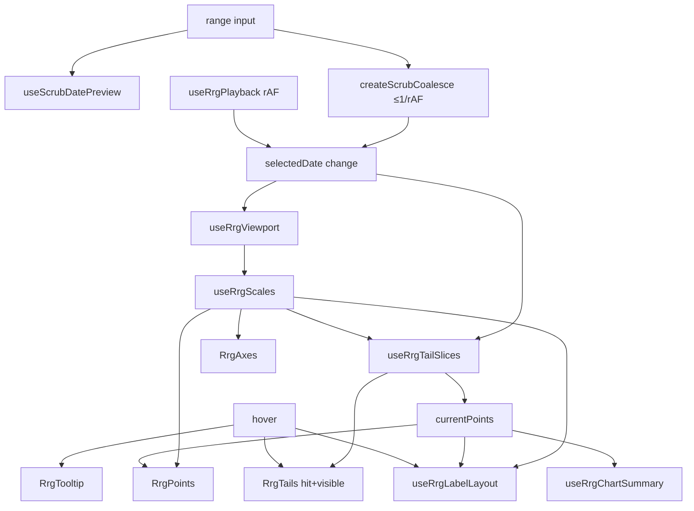

# C17 Research: Performance Testing & Profiling

**Status:** Scrutiny decisions locked; implementation complete (see [C17-performance-profiling.md](./C17-performance-profiling.md), [C17-results.md](./C17-results.md))  
**Date:** 2026-07-25  
**Depends on:** [C16](./C16-optimization.md) complete; long-playback fixtures (C13); demo full-history toggle  
**Audience:** Maintainers / reviewers implementing the harness  
**Parent plan:** [C17-performance-profiling.md](./C17-performance-profiling.md)  
**Prior research:** [C16-research.md](./C16-research.md) (optimization hypotheses; partially stale on “keys still date-based” — see § Post-C16 delta)

---

## Executive summary

C16 shipped the cheap wins (stable tail keys + scrub→chart rAF coalesce). What is still missing is a **repeatable measurement story** across the use cases that matter:

1. **Product mode** — capped `tailLength` (~8–15) with long histories (P up to 500)  
2. **Full-history mode** — demo `fullHistoryTail` / caller `tailLength ≈ P` (1.5k–8k+ SVG lines)  
3. **Interaction modes** — scrub-drag, play, hover-during-scrub, compare (2× charts)

Existing Vitest budgets cover **pure compute** and **one-shot mounts**. They do **not** measure browser FPS, Vue patch/paint cost under N date steps, or full-history DOM. Until that matrix exists, further LOD / path-merge / date-index work is guessing.

**Direction (locked):** C17 is a **measurement + harness** unit. Hard-gate only deterministic invariants (node counts). Soft budgets + artifact JSON for FPS. Playwright is the source of truth for frame timing; a demo button is optional local convenience. Optimization follow-ups stay gated on numbers from this unit.

---

## Goals of this scrutiny

| Goal | Outcome |
|------|---------|
| Inventory what exists today | Avoid reinventing LP fixtures / soft budgets |
| Document hot paths post-C16 | Accurate for implementers who did not write C16 |
| Define a use-case matrix | Shared language for “likely” Sector Orbit + demo loads |
| Propose harness layers | Vitest vs Playwright vs manual DevTools — who owns what |
| Lock decisions | See § Locked decisions |
| Defer product changes | No Canvas; no silent quality loss; renderer-only boundary |

---

## Post-C16 delta (read this if you know C16-research)

| C16-research claim | Status after C16 |
|--------------------|------------------|
| Tail keys include `segment.date` → remount churn | **Fixed** — keys are `` `${ticker}-hit-${i}` `` / `` `${ticker}-seg-${i}` `` |
| Scrub emits every `input` event | **Fixed** — `createScrubCoalesce` + `useScrubDatePreview` |
| Browser FPS unrecorded | **Still true** — primary C17 gap |
| Full-history toggle deferred | **Demo toggle shipped** (`fullHistoryTail`); LOD still deferred |
| Date `find`/`findIndex` per ticker | **Still true** — candidate if profiles show it hot |

Do **not** re-implement stable keys or scrub coalesce as C17 work. Re-measure them as baselines.

---

## Current architecture (hot paths)

### Playback → chart contract

| Path | UI responsiveness | Chart `selectedDate` |
|------|-------------------|----------------------|
| Scrub-drag | Preview index/date updates every `input` | Coalesced ≤1 emit per animation frame (latest index wins) |
| Play | Transport state | One emit per playback tick (`interval` or `skip`) |

### Key files (implementer map)

Hot-path files below also define the **manual FPS re-run trigger** before releases that touch them (see § Cadence).

| Area | Path | Cost on date change | Notes |
|------|------|---------------------|-------|
| Chart shell | `src/components/RrgChart.vue` | Orchestration | ≤200 lines; pointer extracted to `useRrgChartPointer.ts` |
| Tails DOM | `src/components/RrgTails.vue` | Patch `2×T×S` lines | **Stable keys** (post-C16); hover may reorder ticker group |
| Points | `src/components/RrgPoints.vue` | Patch T circles (+ hits) | Keyed by `ticker` |
| Labels | `src/components/RrgLabels.vue` | Patch resolved labels | Layout always runs; visibility by mode |
| Axes | `src/components/RrgAxes.vue` | Tick/grid when domain changes | Cheap unless domain churns hard |
| Tooltip | `src/components/RrgTooltip.vue` | Only when hovered | Extra path during hover-scrub |
| Quadrants | `src/components/RrgQuadrants.vue` | 4 labels | Cheap |
| Viewport | `src/composables/useRrgViewport.ts` + `src/utils/viewportDomain.ts` | `fit` window walk; `max` full extent; `center` cheap | Measure per mode |
| Scales | `src/composables/useRrgScales.ts` | Rebuild D3 scales | Follows domain |
| Tail math | `src/composables/useRrgTailSlices.ts` | O(T×P) finds + O(T×S) segments | Pure path already soft-budgeted |
| Labels | `src/composables/useRrgLabelLayout.ts` | Spatial-bin × T | Spike historically &lt;5ms at T=50 |
| Summary | `src/composables/useRrgChartSummary.ts` | String rebuild | Low vs SVG |
| Scrub | `src/utils/scrubCoalesce.ts`, `src/composables/useScrubDatePreview.ts` | Caps chart updates | Correctness already unit-tested |
| Play | `src/composables/useRrgPlayback.ts`, `src/utils/playback.ts` | rAF delta; no catch-up | CX-aligned |
| Demo effective length | `demo/demoChartProps.ts` → `effectiveDemoTailLength` | Full history expands L | Off by default |

### Cost model (still valid)

| Symbol | Meaning |
|--------|---------|
| T | Visible tickers |
| P | Points per ticker |
| L | `min(tailLength, frameIndex+1)` |
| S | Segments per ticker = `max(0, L−1)` |

**Tail SVG lines (post-C15)** = `2 × T × S` (hit + visible).

| Scenario | T | P | tailLength | Tail lines (approx, last frame) |
|----------|---|---|------------|----------------------------------|
| Sector-like default | 6 | 16 | 10 | ~108 |
| longPlayback* capped | 8 | 50–500 | 10 | **~144** (flat in P) |
| stress | 50 | 30 | 10–30 | ~900–2,900 |
| LP100 full history | 8 | 100 | 100 | **~1,584** |
| LP200 full history | 8 | 200 | 200 | **~3,184** |
| LP500 full history | 8 | 500 | 500 | **~7,984** |
| Generator worst (demo) | ≤100 | ≤500 | P | Can exceed LP500 |

**Implication:** Capped vs full-history are **different products** for profiling. Never average them into one number.

---

## What exists today (measurement inventory)

| Source | Measures | Does not measure |
|--------|----------|------------------|
| `tests/tail.performance.test.ts` | 50×30 pure `useRrgTailSlices` avg **&lt; 16ms** | DOM, FPS, scrub |
| `tests/demo.longPlayback.test.ts` | Mount LP50–500 @ `tailLength: 10`; soft compute 16/40/120ms | Full history; N-step patch; FPS |
| `tests/scrubCoalesce.test.ts` + playback tests | Coalesce correctness + live preview | Frame timing under load |
| `tests/RrgChart.tails.test.ts` | Stable-key DOM identity across date change | Throughput |
| `tests/demo.fullHistoryTail.test.ts` | Toggle → effective length = P | Perf under that length |
| `tests/e2e/chart.spec.ts` | Functional smoke (Chromium) | FPS |
| `tests/e2e/adversarial-screenshots.spec.ts` | Visual review | Perf |
| CI (`.github/workflows/ci.yml`) | typecheck, lint, Vitest, e2e, build | Profiling / FPS job |
| Chrome Performance / FPS | **None recorded in-repo** | — |

### Fixture map

| Fixture | Path | Shape |
|---------|------|-------|
| Long playback generator | `src/scenarios/longPlayback.ts` | 8 sectors; P ∈ {50,100,200,500} |
| Demo catalog | `demo/scenarios.ts` | `longPlayback50`…`500`, `stress` (50×30), `default`, etc. |
| Demo re-export | `demo/longPlayback.ts` | Thin |
| BYO generator | `demo/generateSeries.ts` | T≤100, P≤500 |

---

## Likely use cases (named profiles)

### Product-shaped (assumed Sector Orbit–like until C10)

| ID | Description | Suggested knobs | Gate role |
|----|-------------|-----------------|-----------|
| P0 | Everyday board | T≈6, P≈16–52, L=8–12, `fit` or `center`, `labelMode=auto|hover` | **Must-pass** (FPS ≥55 scrub + play) |
| P1 | Dense sectors | T≈11–16, P≈52, L=10, hover labels | Document-only |
| P2 | Long history, capped trail | T=8, P=200–500, **L=10**, `fit`, hover | **Must-pass** (FPS ≥55 scrub + play) — primary C16/C17 pain point |
| P3 | Stress density | T=50, P=30, L=10–30, `labelMode=hover` | Document-only |

**Assumption (flag explicitly):** Must-pass vs document-only rests on “capped trails is the real product mode; full history is not,” carried from C16. That remains the right call **today**, but it predates [C10](./C10-host-integration.md). **Revisit P0–P3 definitions once C10 lands**, using actual Sector Orbit usage instead of these assumed shapes.

### Demo / extreme

| ID | Description | Suggested knobs | Gate role |
|----|-------------|-----------------|-----------|
| D1 | Full-history LP100/200/500 | `fullHistoryTail=true` | Document-only (no FPS target) |
| D2 | Compare mode | `compare=true` → 2× `RrgChart` | Document-only |
| D3 | Generator ceiling (incl. T=100 full history) | T=50–100, P=200–500 | Document-only; **T=100 full-history = nightly/manual only** |
| D4 | Hover during scrub | P2 + pointer on point/tail mid-scrub | Document-only |
| D5 | Fade on | `showTailFade=true` on P2/D1 | Document-only |

### Interaction dimensions (orthogonal)

Cross profiles with:

1. **Mount** (cold)  
2. **Scrub-drag** (peak input; coalesce under load) — **in FPS bar for P0/P2**  
3. **Play** at representative speeds (`interval` and/or `skip`) — **in FPS bar for P0/P2** (not scrub-only)  
4. **Viewport** `fit` | `max` | `center` (at least document on P2)  
5. Optional: **resize**, **theme flip** (secondary)

---

## Locked decisions

| # | Topic | Decision |
|---|-------|----------|
| 1 | Hard FPS gate in CI? | **No.** Shared runners have inconsistent CPU; hard FPS gates flake and train people to ignore red builds. Soft budgets + **artifact JSON**. **Exception:** **node-count invariants are hard-gated** — deterministic, cheap, and regression tests for C16 stable-key / remount behavior (not a perf approximation). |
| 2 | Must-pass vs document-only | **Must-pass:** P0 and P2, **both scrub and play**. **Document-only:** P1, P3, D1–D5. |
| 3 | Playwright vs demo button | **Both, unequal weight.** **Playwright first** = source of truth (reproducible). Demo “Run perf sample” **afterward** = local DevTools convenience only — not a substitute measurement source. Vitest/jsdom timings remain untrustworthy for the FPS claim. |
| 4 | Target FPS | **≥55 fps** for **scrub and play** on **P0 and P2**. **No FPS target** for D1–D3 (full-history / extreme) — document only. |
| 5 | Harness location | **`tests/perf/`** for Vitest + Playwright specs; **`demo/`** only for interactive UI trigger. Acceptance must include a **package/`files` allowlist check** so `tests/perf/` and perf-only demo code never ship in the npm tarball. |
| 6 | Generator T=100 full-history ceiling | **Include once**, as **nightly / manual**, **not** default PR CI. Outside assumed product profiles; same over-scoping risk as running full-history work on every PR. |
| 7 | Cross-browser | **Chromium-only for v1.** Harness catches regressions in our code over time, not SVG engine parity. Safari/etc. complaints become their own investigation later. |

---

## Cadence (explicit)

| Layer | What | When |
|-------|------|------|
| **A** | Vitest: hard node-count invariants + soft N-step patch timings | **Every PR** (fast, deterministic) |
| **B** | Playwright FPS matrix (P0/P2 must-pass; others optional/document) | **Nightly** + **manual** before any release that touches hot-path files in the architecture table (`useRrgTailSlices`, `useRrgViewport`, `RrgTails.vue`, scrub coalesce, playback, etc.) |
| **Ceiling** | Generator T=100 full-history (D3 extreme) | Nightly / manual only |
| **Not on every PR** | Full Layer B FPS matrix | Avoid CI-cost over-scoping (same discipline as feature-scope warnings in C16) |

Default PR CI stays lean: Layer A + existing unit/e2e smoke. FPS soft results land as nightly artifacts / append-only results entries, not as PR hard-fails.

---

## Proposed deliverables

### Layer A — Vitest (every PR)

1. **Node-count invariants (hard-gate)** — assert hit/segment (or equivalent) counts for capped fixtures; prove sliding window does not explode node identity/count unexpectedly.  
2. **N-step date patch (soft)** — mount chart, walk K dates via `setProps`, record `performance.now()`; soft ceilings; label clearly as JSDOM timing, not FPS.  
3. **Keep** existing pure-compute soft budgets.

### Layer B — Browser harness (Playwright = truth)

1. Build **Playwright rAF FPS / frame-time sampler** first (programmatic scrub + play).  
2. Capture: avg/min FPS, p95 frame time, scrub duration; write **artifact JSON**.  
3. Soft thresholds vs ≥55 on P0/P2; never hard-fail default PR CI on FPS.  
4. Optional later: demo button that runs the same sampler locally for DevTools pairing.  
5. Manual Chrome Performance checklist for LP500 capped + full history (notes go into results).

### Layer C — Reporting (append-only)

1. **`plans/C17-results.md`** (or `plans/C17-results/` per run) — **append-only**, not overwritten.  
2. Each entry: **ISO date**, git SHA (or short hash), environment notes (CI nightly vs local), profile IDs, scrub/play metrics, pass/investigate/document.  
3. Trend must be readable **in the file** without relying on `git log -p` habits.  
4. Link follow-ups (hit LOD only if documented extremes warrant it).

### Explicit non-goals for C17

- Canvas / WebGL rewrite  
- Changing default visual quality  
- Implementing hit LOD / path merge as primary deliverables (separate unit unless P0/P2 clearly regress)  
- Sector Orbit integration (C10) — but **do** schedule profile revisit after C10  
- Hard-fail CI on FPS on shared runners  
- Shipping harness code in the published npm package  

---

## Suggested spike order (implementation preview)

1. Layer A node counts (hard) + N-step patch (soft) on LP200 capped (+ LP100 full-history count as document).  
2. Playwright FPS sampler for P0 + P2 (scrub **and** play); append first results entry.  
3. Nightly workflow + artifact JSON; optional demo button.  
4. Document D1 / P3 / ceiling probe on nightly or manual.  
5. Package allowlist assertion.  
6. Only then propose follow-up optimization unit if gaps remain.

---

## Risks and flake control

| Risk | Mitigation |
|------|------------|
| CI FPS variance | Soft thresholds; nightly / `workflow_dispatch`; never hard-gate FPS on PR |
| Ignoring red builds | Do not put flaky FPS on the critical PR path |
| JSDOM ≠ paint | Never treat Vitest ms as FPS; label metrics clearly |
| Full-history OOMs / timeouts | Keep extremes off default PR matrix; nightly/manual |
| Overwriting baselines | Append-only results with dated entries |
| Assumed profiles drift from reality | Revisit after C10 with real Sector Orbit sizes |
| Harness in npm tarball | Explicit `files` / package test |
| Over-scoping into LOD | Measurement-only unless P0/P2 regress |

---

## Cross-refs

- Unit stub: [C17-performance-profiling.md](./C17-performance-profiling.md)  
- Prior optimization: [C16-optimization.md](./C16-optimization.md), [C16-research.md](./C16-research.md)  
- Playback CX / scrub: [C12-playback-controls.md](./C12-playback-controls.md)  
- Tail hits: [C15-tail-hover.md](./C15-tail-hover.md)  
- Overview gating (“Performance baseline”): [00-overview.md](./00-overview.md)  
- Fixtures: `src/scenarios/longPlayback.ts`, `demo/scenarios.ts`  
- Existing tests: `tests/tail.performance.test.ts`, `tests/demo.longPlayback.test.ts`, `tests/scrubCoalesce.test.ts`

---

## Revision log

| Date | Note |
|------|------|
| 2026-07-25 | Initial scrutiny draft post copy-props ship; architecture reflects stable keys + scrub coalesce + fullHistoryTail |
| 2026-07-25 | Locked open decisions from review: no FPS hard-gate (node-counts hard); P0/P2 must-pass scrub+play ≥55; Playwright-first; Chromium-only; cadence + append-only results + C10 profile revisit |
| 2026-07-25 | Implementation: `tests/perf/` Layer A+B, nightly workflow, demo panel, first local baseline in C17-results.md |
