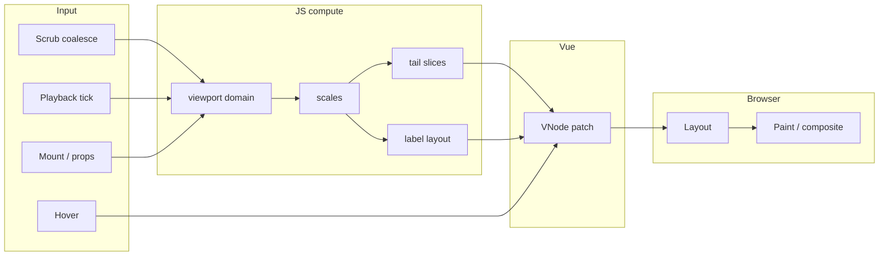
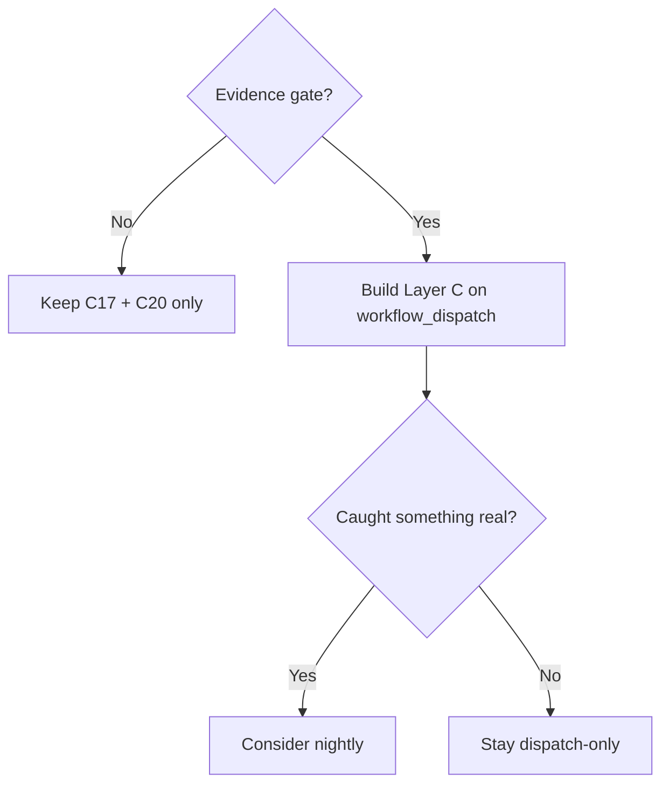

# C21 Scrutiny: Deep Profiling & Production Perf Readiness

**Status:** Decisions locked (2026-07-25) — Layer C/D/E **deferred** until evidence gate (see § Locked decisions)  
**Date:** 2026-07-25  
**Audience:** Maintainers / reviewers  
**Depends on:** [C17](./C17-performance-profiling.md) complete ([research](./C17-research.md), [results](./C17-results.md)); C16 hot-path baseline  
**Related:** [C21 unit stub](./C21-deep-profiling.md) (deferred), [C20](./C20-bundle-size-perf-playbook.md) (ship-now split), [C19](./C19-first-public-publish.md), [C10](./C10-host-integration.md)  
**Naming:** Formerly drafted as “C20 Deep Profiling.” Renumbered to **C21** so **C20** can hold the smaller ship-now hygiene unit. Demo UX remains [C19.5](./C19.5-demo-ux-simplify.md) in this repo.

**Prior layering:** C17 Layer A (Vitest) + Layer B (Playwright FPS). This doc evaluates **Layer C / D / E** (attribution & extras) — not a redo of FPS soft bars.

---

## Executive summary

C17 answered **“are we fast enough?”** with soft FPS (≥55 on P0/P2 scrub+play) and hard node-count invariants. Attribution tooling (CPU profiles, stage marks, metrics bundling) would answer **“where does the time go when we are not?”** — but **only after there is a concrete reason to ask**.

**Locked direction:** Keep this document’s **taxonomy and tool-fit analysis** as shared vocabulary. **Do not build** automated Layer C/D/E until an **evidence gate** passes (real FPS regression in `C17-results.md`, or host real-data dogfood that surfaces a perf problem worth attributing). Meanwhile, ship the cheap, deterministic pieces as **[C20](./C20-bundle-size-perf-playbook.md)** (bundle-size tracking + manual DevTools playbook) — independent of C21.

This matches how the project has sequenced work elsewhere: C17 existed because C16 had a **specific hypothesis**. Building profiling infrastructure ahead of an observed need is the wrong priority for an unpublished library that has not yet completed real-host dogfood.

---

## Goals of this scrutiny

| Goal | Outcome |
|------|---------|
| Map measurable surfaces | Shared language (S1–S10) even if automation waits |
| Inventory C17 gaps honestly | Avoid reinventing FPS / node-count work |
| Evaluate tools for *this* repo | CDP CPU, marks, Lighthouse, traces — fit vs misuse |
| Lock sequencing | Evidence before Layer C/D/E; C20 for free wins now |
| Keep product boundaries | Renderer-only; no host calc; no Canvas pivot in C21 |

---

## What C17 already covers (do not rebuild)

| Capability | Where | Verdict |
|------------|-------|---------|
| rAF FPS (scrub + play) | `npm run test:perf`, `tests/perf/perfHarness.ts` | **Keep as FPS source of truth** |
| Soft ≥55 P0/P2 | Nightly + local; optional `PERF_HARD_GATE` | Unchanged |
| Hard node-count invariants | `tests/perf/nodeCounts.test.ts` via `npm test` | Unchanged |
| Soft JSDOM date-patch timings | `tests/perf/datePatch.test.ts` | Label remains “not FPS” |
| Pure tail-slice budget | `tests/tail.performance.test.ts` | Compute-only smoke |
| Demo FPS button | `demo/DemoPerfPanel.vue` | Convenience only |
| Append-only FPS log | `plans/C17-results.md` | Keep; C21 may add a **profile results** sibling **if/when** built |

### Gaps (valid, but not all justify building now)

| Gap | Disposition |
|-----|-------------|
| No Chrome **CPU profiles** in-repo | **Defer** (Layer C) until evidence gate |
| No **User Timing** marks around hot paths | **Defer** (Layer D); if ever, harness/demo injection only |
| No **CDP Performance** metrics bundle | **Defer** with Layer C |
| No **Lighthouse** on demo | **Out of C21** — demo-page quality → C19 / C19.5 checklist if wanted; not renderer profiling |
| No **memory / heap** story | **Defer** (O5); node counts remain the DOM-scale signal |
| No **dev playbook** | **Ship now in C20** (`docs/perf.md`) |
| No **bundle / import-cost** check | **Ship now in C20** (pulled out of profiling scope) |

---

## Architecture reminder — what can bottleneck

Reuse C17’s hot-path model (post-C16). Attribution (when built) should target stages **separately**:

| Stage | Likely files | Symptom if hot |
|-------|--------------|----------------|
| Date resolve / finds | `chartDate.ts`, `useRrgTailSlices.ts` | CPU in JS; FPS dips even with stable keys |
| Viewport / scales | `viewportDomain.ts`, `useRrgViewport.ts`, `useRrgScales.ts` | Cost scales with mode (`fit` walks window) |
| Tail segment build | `useRrgTailSlices.ts` | Pure ms rise with T×P / T×S |
| Label layout | `useRrgLabelLayout.ts` | Spikes on dense T + `auto` labels |
| SVG patch | `RrgTails.vue`, `RrgPoints.vue`, `RrgLabels.vue` | Many attribute updates per frame |
| Paint | Browser (SVG line count) | High paint time; node counts already warn |
| Scrub path | `scrubCoalesce.ts`, playback UI | Input feels laggy; chart may still be ≤1/rAF |
| Hover during scrub | pointer + tooltip + label/tail reorder | Compound path (D4 in C17 matrix) |
| Compare mode | 2× chart in demo | Nearly 2× everything (D2) |

**Product modes stay distinct:** capped `tailLength` (P0/P2) vs full-history (D1/D3). Never average profiles across those modes.

---

## Measurement surfaces (shared vocabulary)

| # | Surface | Question | Good signals | Weak / misleading signals |
|---|---------|----------|--------------|---------------------------|
| S1 | **Frame budget** | Do scrub/play hold ≥55 fps? | C17 rAF FPS | Lighthouse Performance score |
| S2 | **JS attribution** | Which functions burn CPU on a slow scrub? | CDP CPU profile; marked spans | Aggregate FPS alone |
| S3 | **Frame breakdown** | Scripting vs layout vs paint? | CDP metrics / trace categories | Vitest `performance.now` in happy-dom |
| S4 | **Compute-only** | Is pure math the problem? | Vitest budgets on composables/utils | Browser FPS |
| S5 | **DOM scale** | Remounting / exploding nodes? | C17 node counts | FPS on a beefy laptop |
| S6 | **Interaction latency** | Scrub `input` → chart date applied | Marks around coalesce (if ever) | Lighthouse TTI |
| S7 | **Cold mount** | First paint with P2 data | Mount marks; optional page LCP | Continuous scrub FPS |
| S8 | **Multi-instance** | Compare / host with 2 charts | D2 + memory (if ever) | Single-chart FPS |
| S9 | **Ship cost** | Parse/eval of `dist` ESM + CSS | **C20 bundle-size tracking** | Runtime FPS |
| S10 | **Host page health** | Embedding tanks INP/TBT? | Host Lighthouse / RUM later | Demo-only Lighthouse as host proxy |

---

## Tool options (fit — retained for when C21 unlocks)

### A. Playwright + CDP CPU Profiler — **strong fit for S2** (deferred)

- Capture around C17 P0/P2 scrub/play; `.cpuprofile` + summary JSON.
- **When unlocked:** `workflow_dispatch` only at first (not scheduled nightly). Promote to nightly only after it has caught something real once.

### B. User Timing marks — **fit if scoped** (deferred)

- **Locked:** harness/demo injection only — **no `src/` marks** in production bundle path.

### C. CDP Performance metrics / Playwright trace — **medium fit for S3** (deferred with Layer C)

### D. Lighthouse — **out of C21**

| Target | Useful? | Notes |
|--------|---------|-------|
| Chart scrub FPS | **No** | Does not drive scrubber; score ≠ RRG smoothness |
| Demo page health | Maybe | Belongs on **C19 / C19.5 publish checklist** as optional one-liner — **not** this profiling unit |
| Host production | Later | C10 / host CI |

Do **not** fold Lighthouse into C21 because it is “cheap next to other nightly jobs” — that is scope-by-convenience.

### E. Memory / heap — **deferred** (flaky/heavy; no evidence of need)

### F. Bundle / import cost — **C20 now** (not C21)

Deterministic, cheap, publish-adjacent; should not wait on profiling locks.

### G. Manual Chrome Performance + Vue DevTools — **C20 playbook now**

Operationalize without automation: FPS soft-fail → DevTools steps → map to hot-path table.

### H. What not to treat as primary

| Tool | Why not primary |
|------|-----------------|
| Lighthouse score as chart gate | Wrong interaction model |
| Hard CPU-ms on shared runners | Same flake class C17 rejected for FPS |
| Always-on profiling in published `dist` | Tax every consumer |
| Safari matrix in C21 v1 | C17 Chromium-only |
| Canvas / LOD in C21 | Follow-ups gated on evidence |

---

## Proposed layers (status after lock)

| Layer | What | Status |
|-------|------|--------|
| **A** | Vitest node counts + soft JSDOM timings | **Exists** (every PR) |
| **B** | Playwright rAF FPS P0/P2 | **Exists** (nightly + manual) |
| **C** | CDP CPU profile + optional metrics (P2 scrub+play) | **Deferred** — `workflow_dispatch` only when unlocked |
| **D** | Opt-in User Timing via harness/demo injection | **Deferred** — no `src/` marks |
| **E** | ~~Demo Lighthouse + bundle~~ | **Split:** Lighthouse ≠ C21; bundle → **C20** |
| **Playbook** | `docs/perf.md` + CONTRIBUTING link | **C20 now** |

---

## Evidence gate (hard prerequisite for building C21)

Build Layer C/D (and any C21 automation) **only if at least one** of:

1. A **genuine FPS regression or soft-fail** is recorded in [`C17-results.md`](./C17-results.md) (or equivalent dated note) that needs attribution, **or**
2. **Host real-data dogfood** ([C19](./C19-first-public-publish.md) / [C10](./C10-host-integration.md)) surfaces a **perf problem** worth attributing (jank, long frame, host complaint) — annotated in dogfood notes.

**Package-only synthetic profiles are not sufficient** to unlock C21. If real Sector Orbit data never produces a perf complaint, most of Layer C/D may remain unnecessary — that is an acceptable outcome.

Until the gate passes: C21 unit stays **draft / deferred**; taxonomy in this doc remains valid reference.

---

## Locked decisions

| ID | Decision |
|----|----------|
| **O1** | **Harness/demo injection only** if Layer D is ever built. **No `src/` marks** in the default publish path. |
| **O2** | **Lighthouse is out of C21.** Optional demo-page note may live on C19 / C19.5 checklist — not renderer-profiling scope. |
| **O3** | When Layer C is built: **`workflow_dispatch` only** (no scheduled nightly). Promote to nightly only after it has caught something real once. |
| **O4** | When Layer C exists: **artifacts only** in v1 — no numeric profile budgets until baselines exist. |
| **O5** | **Defer** memory / heap snapshots. |
| **O6** | **Bundle-size tracking is not C21.** Ship as **[C20](./C20-bundle-size-perf-playbook.md)** (track + soft warn); independent of profiling. |
| **O7** | C21 is **not a publish blocker.** Implement **after** evidence gate (O8) — **not** parallel to C19.5 / publish push. |
| **O8** | **Hard prerequisite:** host real-data dogfood (or a recorded C17 regression) must surface a **need to attribute** before Layer C/D is built. Not optional-or-synthetic. |
| **O9** | Playbook: **`docs/perf.md` + CONTRIBUTING link** — ship in **C20**. |

---

## What ships when

| When | What |
|------|------|
| **Now (C20)** | Bundle-size tracking (soft warn); manual perf playbook |
| **C19 path** | Real-data dogfood notes; optional demo Lighthouse one-liner on checklist if desired |
| **C21 (only if evidence gate)** | Layer C (± D) per tool sections above; append-only profile results log |

**Explicit non-goals for C21:** replacing C17; hard CPU CI; Canvas/LOD; shipping profiler in npm; claiming Lighthouse = chart perf; building attribution infra “just in case.”

---

## Risks (still relevant when unlocked)

| Risk | Mitigation |
|------|------------|
| Premature infrastructure | Evidence gate (O8); C20 absorbs free wins |
| Artifact sprawl | gitignore profiles; CI upload on dispatch only |
| False confidence from Lighthouse | Kept out of this unit |
| Flaky shared-runner CPU noise | No nightly until proven useful; soft artifacts only |
| Scope creep into optimization | Measure when needed; fixes are separate units |

---

## Cross-refs

- Deferred unit: [C21-deep-profiling.md](./C21-deep-profiling.md)  
- Ship-now split: [C20-bundle-size-perf-playbook.md](./C20-bundle-size-perf-playbook.md)  
- FPS harness: [C17-research.md](./C17-research.md), [C17-results.md](./C17-results.md)  
- Hot paths: [C16-research.md](./C16-research.md)  
- Publish / dogfood: [C19-first-public-publish.md](./C19-first-public-publish.md)  

---

## Revision log

| Date | Note |
|------|------|
| 2026-07-25 | Initial draft as C20 (open O1–O9) |
| 2026-07-25 | **Renumbered to C21.** Decisions locked from review: evidence-gated deferral of Layer C/D/E; Lighthouse out; dispatch-only CPU; O8 hard gate; O6 + playbook split to C20 |
